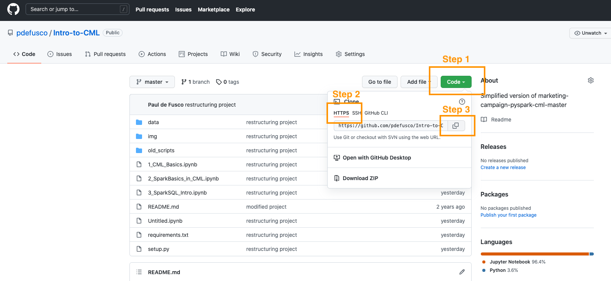
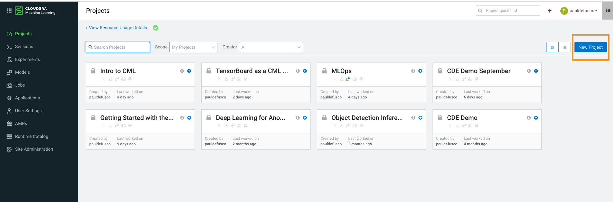
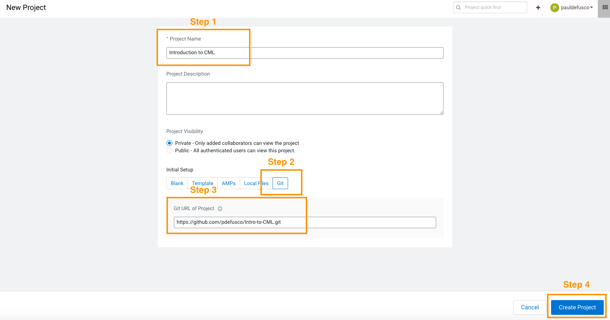
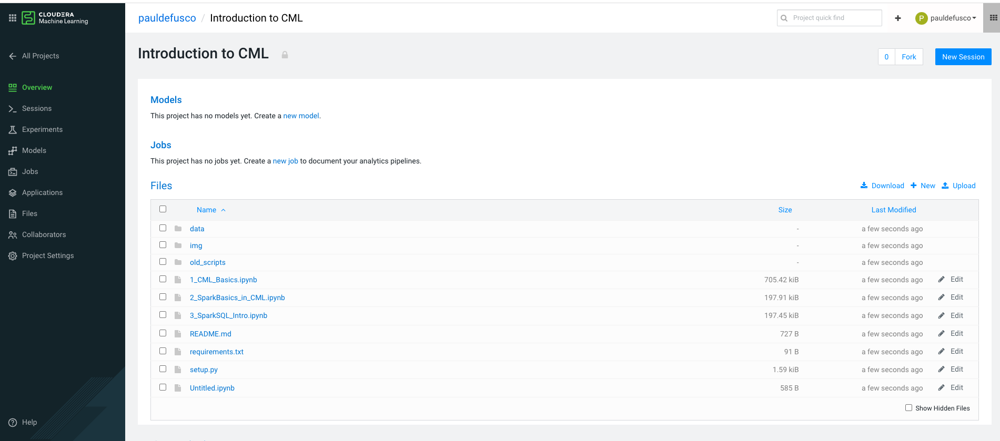
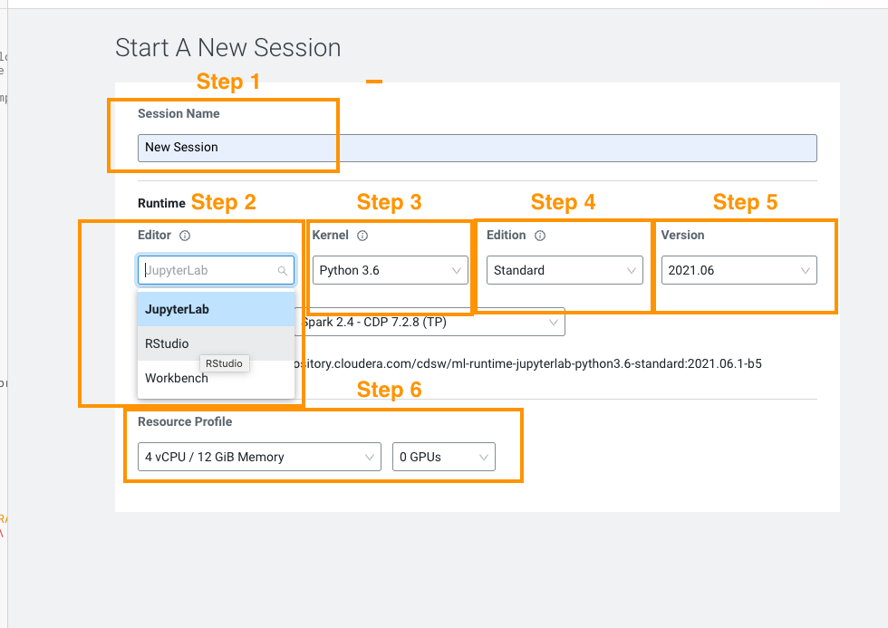
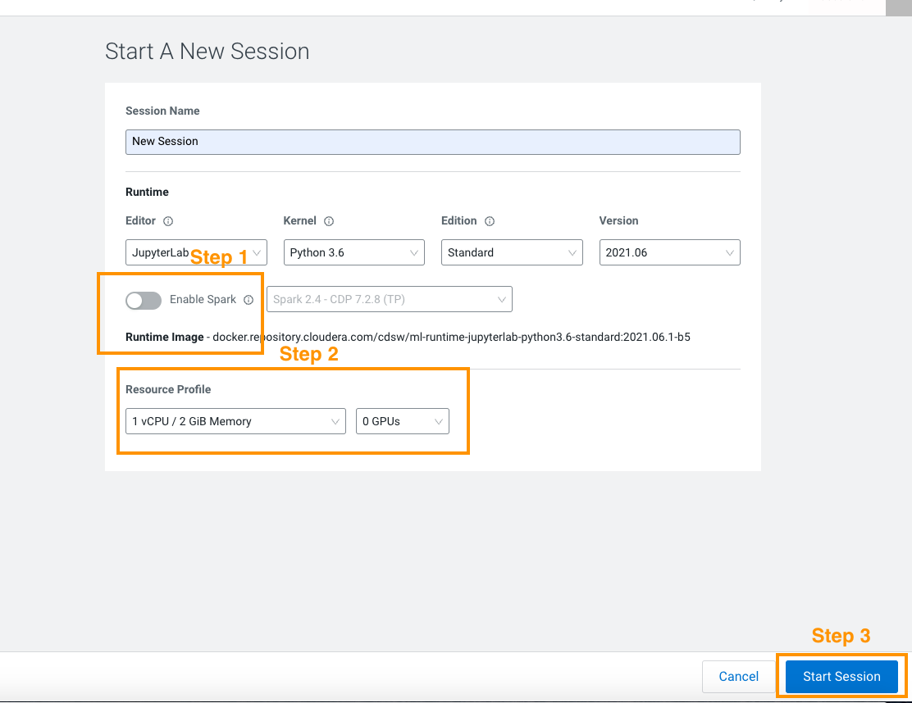
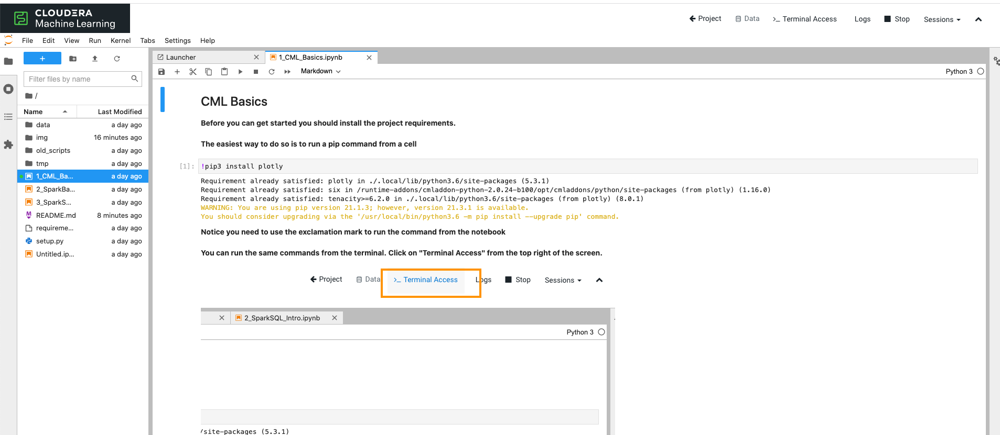

# Introduction to Cloudera Machine Learning

###### Cloudera Machine Learning is Cloudera’s cloud-native machine learning platform built for CDP. Cloudera Machine Learning unifies self-service data science and data engineering in a single, portable service as part of an enterprise data cloud for multi-function analytics on data anywhere.

###### It empowers organizations to build and deploy machine learning and AI capabilities for business at scale, efficiently and securely, anywhere they want. It’s built for the agility and power of cloud computing, but isn’t limited to any one cloud provider or data source.

###### This projects walks you through some of the most basic features in CML and is designed as a starting point to those who are new to the platform

### Project Overview:

#### 1. CML Basics

Downloading project requirements and visualizing data in a notebook

#### 2. PySpark Basics for CML

Tips for loading and saving data with Spark in S3, ADLS and more

#### 3. Spark SQL Basics

A Spark SQL quickstart for the PySpark beginner

#### 4. A sample R Shiny application 

A basic dashboard with the Applications feature

### Getting Started... How to Clone this Repository into a CML Project

CML provides the ability to use GitHub for project version control. This means you can create a CML project from a GitHub repository, make modifications and push back your updates.

In order to do so, navigate over to your GitHub repository of choice.

Copy the GitHub Repository URL by clicking on the green button as shown below. Make sure you select the "https" format for the URL.

From the CML Projects landing page, click on "New Project" on the far right.

Enter a name and optionally a brief description. You can decide if you want this project to be public (accessible to any CML users) or private (accessible to any CML users you wish to give access to).

Select the "git" tab and paste the GitHub repository URL you copied earlier.  

Now CML has cloned a project for you. In the 1_CML_Basics notebook you will learn how you can pull and commit your changes to this project. 

Next we'll take a look at how to start CML Sessions. 

### How to Execute the Notebooks and Scripts in CML Sessions

You can interactively execute code in your IDE of choice with Sessions. 

One of the main advantages of notebooks is that as you develop new scripts you can see outputs from your code in cells.

To get started from the project's landing page, hover over to the far right and Click on "New Session".

Enter a Session name and then set Runtime settings. 

This is a Python project so we will choose the Jupyter Notebook Editor. Keep in mind if you want to execute a .py file, the Workbench editor is a better choice. 

The Kernel represents the programming language and version you want to use. In this case it will be Python. Anything above 3.6 will do. 

The Edition and Version fields refer to the actual CML Runtime. Runtimes allow you to prepackage certain dependencies for reusability in Sessions, Jobs, Models, etc.

It's a particularly popular feature in larger teams of CML users as it allows each contributor to create code with their preferred package versions while managing all runtimes from one place.

For the purposes of this demo we can stick to the default runtime choice, so no changes needed here. 

Finally, the Resource Profile allows you to pick CPU, Memory and GPU to be allocated for the session. In essence it reflects how much horsepower you will need. 

It is recommended to use GPUs sparingly as their cost is dramatically higher. 

Before we launch the session, notice you optionally can select wether to enable Spark. This is not needed until you reach Notebook 2 and 3, so you can either leave this off or turn it on later when you are ready for those.

Here is a screenshot of the recommended Session Settings for this initial test. Click on "Start Session" and you will be able to finally take it for a spin!

After a few seconds your first Notebook will be ready. Congratulations, you are now in JupyterLab, a work environment for Notebook-based development with Python!

Click on Notebook 1, "CML Basics" and follow the instructions there to learn how you can use notebooks.

